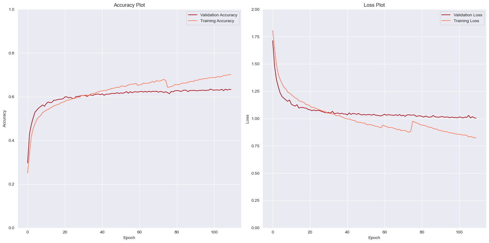
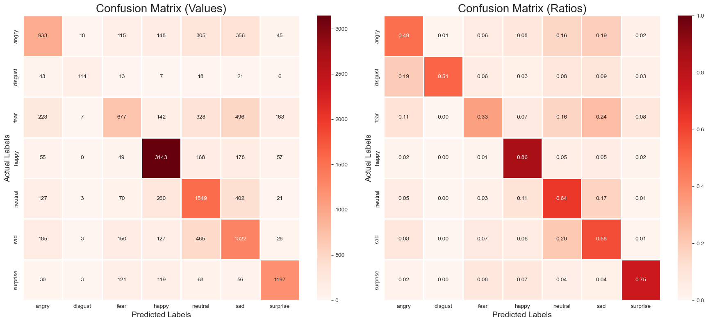

<p align="center">
  
</p>

# **<span style="color:DarkRed">Facial Expression Recognition:</span>**

## **<span style="color:FireBrick">Intro:</span>**
**This repository contains the code for my facial expression recognition project, which was developed as part of my internship with Code Clause AI. The project aims to accurately classify facial expressions and emotions using deep learning techniques.**

## **<span style="color:red">Key Features:</span>**

1. **Facial Expression Classification**: The project leverages deep learning models to classify facial expressions into different emotion categories, such as happy, sad, angry, surprised, etc. This allows for real-time analysis and understanding of people's emotions based on their facial expressions.

2. **Deep Learning Model**: The project utilizes a state-of-the-art deep learning model, such as Convolutional Neural Networks (CNNs), to capture spatial and temporal features from facial images or video sequences.

3. **Real-time Emotion Detection**: The developed system can perform real-time emotion detection by capturing and analyzing facial expressions from live video streams or webcam input. This feature enables applications such as emotion-aware interfaces, sentiment analysis, and personalized user experiences.

4. **Data Augmentation**: The project includes data augmentation techniques, such as random rotation, and flipping, are employed to increase the diversity and robustness of the training data.

5. **Model Training and Evaluation**: The repository provides scripts and tools for training the facial expression recognition model using annotated datasets. It also includes evaluation metrics to assess the performance of the trained model, such as accuracy, Confusion matrix.

6. **Documentation and Usage Guide**: The repository includes comprehensive documentation and a usage guide that provides clear instructions on how to set up the project, train the model, perform inference, and utilize the facial expression recognition system in different contexts.
  
## **<span style="color:Crimson">Getting Started:</span>**

To get started with the facial expression recognition project, follow these steps:

1. Clone this repository to your local machine ```https://github.com/ahmadMfouad/ExpressionVsClause.git```.
2. Install the requirements by ```pip install -r requirements.txt```.
3. Prepare your dataset of facial expression images organize them in the appropriate directory structure as the dataset linked below.
4. Preprocess the dataset using the provided scripts or tools.
5. Train the facial expression recognition model using the prepared dataset.
6. Evaluate the performance of the trained model using the provided evaluation metrics.

## **<span style="color:IndianRed">Process:</span>**
During the development of the facial expression recognition model, the following steps were followed to improve its performance:

1. **Initial Model Training**: The model was initially trained without data augmentation. After several iterations, the maximum validation accuracy achieved was approximately 0.6303. 

2. **Data Augmentation**: To enhance the model's ability to generalize and capture diverse facial expressions, data augmentation techniques were applied. The training dataset was augmented by applying transformations such as random cropping, rotation, and flipping to increase its size and variability.

3. **Augmented Data Integration**: The augmented data was then combined with the original training data. This enlarged dataset provided a more comprehensive representation of facial expressions, enabling the model to learn more robust features.

4. **Output Activation and Loss Function**: The linear activation function was used as the output activation for the facial expression recognition model. Additionally, the loss function was selected with `from_logits=True` to handle the model's output logits directly, improving the training process.

5. **Validation Accuracy Improvement**: With the inclusion of augmented data and the appropriate choice of activation and loss functions, the validation accuracy exhibited a slight improvement, reaching approximately 0.6352. Although the increase may not be substantial, it indicates progress in the model's ability to generalize and recognize facial expressions accurately.

Despite achieving a training accuracy of 0.689, further training would likely lead to overfitting, causing the validation accuracy to decrease rather than improve. This can be observed in the accompanying plots, where the validation accuracy reaches a plateau and shows minimal improvement.

The limitations in the model's performance on certain labels, such as fear or disgust, can be attributed to the low resolution of the images. The model primarily excels in identifying happy expressions, which are relatively easy to recognize due to prominent smiles and wide cheeks. However, when it comes to more nuanced emotions like fear or disgust, the model's performance is comparatively weaker.

Therefore, it is evident that the model's ability to accurately classify emotions is affected by the lack of visual details in the low-resolution images. While it may successfully identify happy expressions, it struggles with more complex emotions. Improving the resolution of the images or providing higher-quality visual input could potentially enhance the model's performance in recognizing a wider range of emotions.


## **<span style="color:salmon">Metrics & Plots:</span>**
### **<span style="color:Crimson">Accuracy & Loss plots with epochs:</span>**
<p align="center">
  
</p>

### **<span style="color:FireBrick">Confusion Matrices:</span>**
<p align="center">

**<span style="color:FireBrick">Due to different amounts of images for each label i plotted the ratios for better visualization: </span>**
<p align="center">
  
</p>


## **<span style="color:IndianRed">Data Used:</span>**
**Face expression recognition dataset**
[](https://www.kaggle.com/datasets/jonathanoheix/face-expression-recognition-dataset)
## **<span style="color:salmon">Language Used:</span>**

## **<span style="color:LightCoral">Some of the technologies I have worked with:</span>**
      
